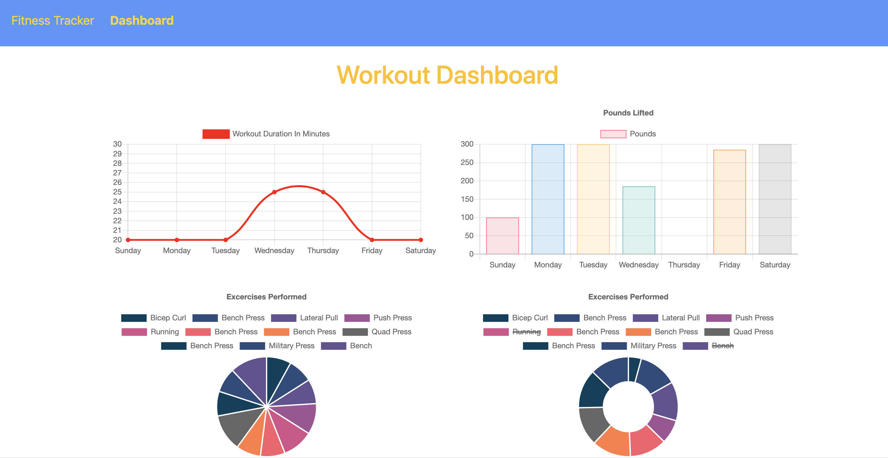

# Unit 06: Workout Tracker

# Table of Contents (Optional)
N/A

# Installation
View website. https://safe-wave-76774.herokuapp.com/

View Github Repository. https://github.com/alexahanthony/workout-tracker

# Usage
This website allows you to keep track of your workouts and exercises. You can add a cardio or weightroom workout and details about each. You can view the dashboard which shows your workout history overtime. 

# Credits
There were no collaborators, (other than classmates and teacher feedback).

# NPM Packages: 
* "compression": "^1.7.4",
* "express": "^4.16.3",
* "fs": "0.0.1-security",
* "mongoose": "^5.3.16",
* "morgan": "^1.9.1"

# License
N/A

# Badges
N/A

# Contributing
N/A

# Tests
N/A

